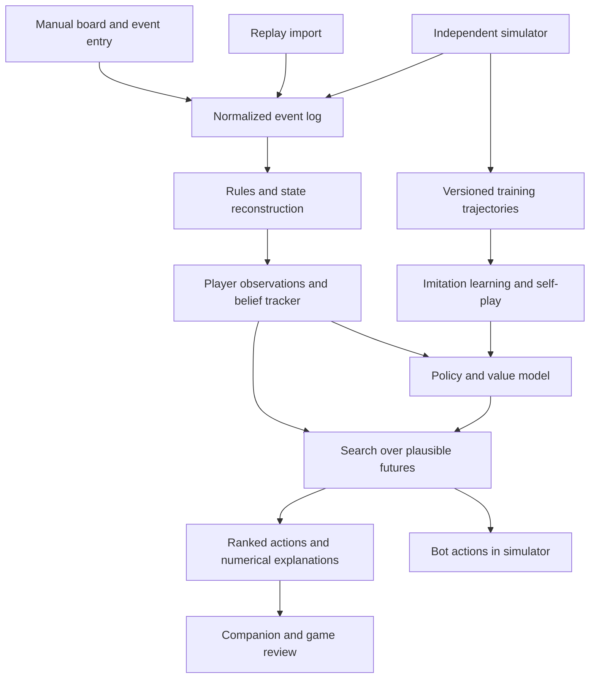

# Catan AI: research and implementation blueprint

## 1. Recommendation and project definition

Build one decision engine that powers a full-game bot, a game-tracking companion, and a research workbench. Its core should combine **probabilistic card tracking, a learned policy and value model, and search over plausible futures**. Start with a rules-correct simulator and settlement advisor; use the same observation and decision interfaces when adding full-game play, historical training, and self-play.

The intended system should understand a board, remember events, infer possible opponent hands, estimate opponents' plans, compare legal actions, and explain its recommendations. It should eventually handle opening settlements and roads, expansion, cities, development cards, the robber, discarding, maritime trades, and player negotiation. Training from prior games should improve its initial knowledge; self-play and search should allow improvement beyond imitation.

A strong implementation is feasible. A claim of mathematically solved, game-theoretically optimal four-player Catan is not supported by the evidence examined. The useful engineering target is a bot with reproducible strength against varied opponents, calibrated uncertainty, and no access to information unavailable to its player. That is a substantial research and engineering project, with useful intermediate products.

This report assesses sources available on **11 September 2026**. It distinguishes published results, repository claims, targeted source inspection, and proposed engineering choices. It does not present newly trained models or independently reproduced playing-strength benchmarks.

### The three connected products

| Product | What it does | First useful deliverable |
|---|---|---|
| Full-game bot | Plays every decision in an independent simulator; trains and competes against other policies | Completes four-player games using legal actions and a reproducible baseline |
| Companion | Accepts a board and events, tracks all players, ranks moves, and supports corrections | Manual board entry, opening advice, resource beliefs, event timeline, undo/replay |
| Research workbench | Generates training data, compares algorithms, evaluates versions, and reviews games | Versioned rules, source/data register, frozen opponent suite, repeatable experiments |

The proposed initial scope is four-player base Catan, ten points to win, ordinary independent dice, trading, and standard hidden information. Variants need separate ruleset identifiers and evaluations. Use the current publisher rulebook as the specification. [1]

## 2. What “GTO” means here

In a finite, explicitly specified multiplayer game, a Nash equilibrium is a **joint strategy profile** in which no single player improves their expected payoff by changing strategy alone. It does not supply a universal best move independent of what the other three players do. Nor does it guarantee protection against arbitrary coordinated deviations by multiple opponents.

There is a technical distinction worth preserving: if exactly one player wins and winning is worth one, the four terminal utilities sum to one. This is a multiplayer constant-sum formulation. It still lacks the special structure of **two-player zero-sum** games; calling Catan simply “non-zero-sum” misses the real obstacle. Trades can help two players simultaneously by reducing the remaining players' chances.

ReBeL provides an important precedent for combining learning and search under hidden information, but its equilibrium-convergence result is for two-player zero-sum games. Deep CFR is another relevant research reference, not a ready-made four-player Catan solver. Pluribus demonstrates that strong empirical multiplayer play is possible; it does not establish that Catan is solved. [2], [3], [4]

Use three distinct objectives:

1. **Playing strength:** maximize probability of winning against a declared distribution of opponents.
2. **Robustness:** retain strength when opponents, boards, seats, and trading styles change.
3. **Equilibrium research:** measure unilateral improvement opportunities in a restricted, explicitly defined game or policy population.

For a policy profile `pi`, an equilibrium diagnostic is:

```text
gap_i(pi) = max over alternative policies pi'_i:
            E[u_i(pi'_i, pi_-i)] - E[u_i(pi_i, pi_-i)]
```

Computing the exact maximum for full Catan is itself difficult. Training an approximate best response measures a discovered improvement opportunity, generally a lower bound on the true best-response gain, not a certificate of low exploitability. A weak challenger failing to beat the bot proves little.

For the practical product, optimize `P(win | observations, opponent models, ruleset)`. Label displayed probabilities accordingly. A search estimate is conditional on a model of the game and the opponents; it is not an objective probability that remains correct against everyone.

## 3. Existing work worth studying

### Research closest to the intended system

**Dobre and Lascarides, POMCP with Human Preferences in Settlers of Catan, 2018.** This is the closest research match: four-player play, hidden information, trading, and planning informed by a small human corpus. The authors use 60 games to learn preferences among legal action types. Their strongest reported variant wins 40.70% against three Stac bots at 10,000 planning iterations and 53.65% at 40,000. Evaluations use 2,000 games per condition. Trading is capped at three offers per turn. The method uses a single observer and a factored belief approximation, including independence between players' resource hands; it is not an exact joint multiplayer solver. These are historical benchmark results, not estimates against contemporary experts. [5]

**The associated MCTS code is unusually relevant.** The `sorinMD/MCTS` repository documents a Catan model with beliefs, resource tracking, POMCP, single-observer ISMCTS, and belief-search variants. It includes trade and negotiation configuration and learned action-type preferences. This makes it a valuable reference implementation before inventing another hidden-information search system. The README identifies an MIT license. [6]

**Charlesworth's Settlers RL project.** This implements four-player Catan with PPO, structured action heads, masks, and a learned policy used in forward simulation. Its search is primarily evaluation of sampled root actions through policy rollouts, rather than a full conventional tree search. The repository includes pretrained weights and reports approximately one month of training on a 32-core machine with an RTX 3090; the author explicitly describes the result as below a good human's level. Dependencies are from the 2021-2022 software stack. No license file was visible in the inspected root, and GitHub returned no recognized license. Study the design; resolve reuse terms before adopting its code or weights. [7], [8]

**Gendre and Kaneko, 2020.** Cross-dimensional neural networks combine spatial and non-spatial information and outperform the paper's JSettlers baseline. The actual experiment uses two players without domestic trading. It supports investigating board-aware representations, but it does not establish performance in the target four-player trading game. [9]

**SmartSettlers, Szita, Chaslot, and Spronck, 2009 conference / 2010 proceedings.** This established that MCTS could play Catan effectively against contemporary JSettlers agents. However, its implementation removes imperfect information, and its agent does not conduct domestic trades. Its important contribution is the search precedent; its result should not be represented as solving standard hidden-information Catan. [10]

**Strategic dialogue research.** Cuayahuitl, Keizer, and Lemon apply deep reinforcement learning to proposing and responding to resource trades. This is evidence that negotiation deserves its own learned component. It is not a replacement for learning placement, development, and the rest of the game. [11]

### Implementation landscape

The following table describes relevance, not an independently established strength ranking.

| Project | Useful capability | Main qualification | Recommended role |
|---|---|---|---|
| **Catanatron** | Python engine, bot interfaces, web UI, Gymnasium integration, data generation | Full-state bot API needs an observation boundary; Gym action encoding needs trading work | Primary prototype foundation [12], [13], [14], [15] |
| **sorinMD/MCTS** | Belief tracking, POMCP, ISMCTS, Catan-specific action structure | Older Java research stack; approximations and configuration require inspection | Main search reference and possible benchmark [6] |
| **STACSettlers** | Trading agents, replay infrastructure, human-game database tooling | Older dependencies; some agent configurations explicitly require full observability | Negotiation and research-data reference [16] |
| **JSettlers2** | Established client/server implementation and heuristic bots | Not designed primarily as a high-throughput Python learner | Independent rules/agent comparison target [17] |
| **Settlers RL** | PPO, pretrained policy, full-game architecture, forward search | Author reports sub-expert strength; older stack and unclear license | Learning architecture reference [7], [8] |
| **Monte Catano** | Compact Rust MCTS engine and command-line protocol | Material rules and hidden-information gaps in inspected version | Performance ideas; unsuitable as drop-in target engine [18], [19], [20] |
| **NoahLaforet/CatanBot** | Visual companion, event tracking, opening recommendations | README specifies handcrafted heuristics and one-ply evaluation, no ML | Product/UI reference [21] |
| **Catan Counter** | Event parsing, probabilistic hand variants, hand-count constraints | No recognized license in inspected repository; claims need independent tests | Parser and tracking design reference [22] |
| **Cocaco** | Bayesian card tracking with correlated possibilities | Browser integration and AGPL license; includes functionality beyond this project | Study belief representation and uncertainty display [23] |
| **Catanatron 1v1 fork** | Teacher data, imitation learning, DAgger, masks, evaluation, optional PPO | Different rules: 15-point target, balanced dice, friendly robber, nine-card threshold | Training-pipeline ideas, separate benchmark only [24] |

Recent repositories such as `BenjaminL1/catan_rl` and `AlgoCatan/RLCatan` add to the experimental landscape. Their availability does not establish a common benchmark or a strongest public four-player agent. The former explicitly targets 1v1; the latter advertises a reinforcement-learning capstone implementation. [25], [26]

### What targeted source inspection changes

**Catanatron is more capable than old descriptions suggest.** The inspected revision, `ecf931181b9a65bb4116a2153fb78c16f1438e00` dated 8 September 2026, includes offer, accept, reject, confirm, and cancel trade actions. `Player.decide` receives the complete game object and permits creating a trade offer beyond the supplied playable-action list. Consequently, automatic enumeration of ordinary moves is not an exhaustive proposal generator. [13]

**The standard Gym wrapper is not the finished training interface.** Its default opponent is one random player, and the inspected discrete action array lacks domestic-trade actions. Separately, its standard resource features expose the player's own resource types and opponent hand totals, with opponent inference left as TODOs. Therefore, distinguish the full engine API from the more restricted observation features: the latter does not by itself provide the required history-based beliefs. [14], [15]

**Monte Catano needs more than a UI wrapper.** At inspected revision `64edc0a074b97500e505157d0cafc9706d45f140` dated 12 June 2026, the action enum includes bank trades but no domestic trade actions. Resource production increments player holdings directly without bank-supply accounting in that routine, and discarding repeatedly removes a most-abundant resource automatically. Search starts from a complete `GameState` containing all player resource and development-card arrays. No observation/belief boundary was present in the inspected search path. Those differences invalidate direct strength comparisons with the proposed ruleset. This was static inspection, not a complete defect audit. [18], [19], [20]

**LLM results need careful reading.** *Agents of Change* (2025) evolves Catan prompts and code, but evaluates two-player games against a fixed AlphaBeta bot, with ten-game evaluations of selected agents. Its reported improvements include average victory points; these are not equivalent to expert-level win rates. Its useful role here is generating candidate heuristics and explaining numerical analyses. It provides little evidence for putting an LLM in charge of the core high-volume search loop. [27]

## 4. Mathematical card tracking

### Represent information, not a guessed hand

For player `i`, maintain a probability distribution over hidden state `X` conditional on everything that player has observed:

```text
b_i,t(X) = P(X | public event history, player i's private observations)
```

`X` includes opponent resource holdings, hidden development cards, and relevant remaining-deck uncertainty. Keep four notions separate: known facts, logically possible states, probabilities assigned to those states, and behavioral assumptions that influence the probabilities.

Exact tracking is often possible for stretches of play. Starting resources, production, visible purchases, and completed public trades permit arithmetic updates when the event stream is complete. Hidden thefts, hidden discards, private development draws, and missing observations introduce uncertainty. The companion should never display a single guessed hand as established fact.

### The update rule

A general Bayesian filtering update is:

```text
b_(t+1)(x') proportional to sum_x b_t(x)
    * P(observed event and next hidden state x' | x, public context)
```

For a known purchase, subtract the cost and discard impossible states. For public production, apply the dice outcome, buildings, robber, and supply rules. For a random theft from a victim with resource-count vector `h`, use:

```text
P(stolen resource = r | h) = h[r] / sum(h)
```

Example: a known hand contains two ore and one wheat. An unseen random theft yields two possibilities: one ore plus one wheat with probability `2/3`, or two ore with probability `1/3`. The thief's hand changes in the corresponding branch. These are linked outcomes; independently sampling both players can create impossible combinations.

Subsequent observations can resolve ambiguity. If the victim then spends wheat, only branches containing enough wheat survive, assuming no intervening acquisition. This makes a resource tracker substantially more informative than a running count with an “unknown” bucket.

### Random events and strategic actions require different likelihoods

Hidden discards are chosen by a player. They are not uniformly random unless an explicit baseline opponent model makes that assumption. Enumerate feasible discarded multisets or sample them from a learned discard policy. A trade refusal is not proof of lacking the requested card: the player might want a different price, dislike the offerer, or be retaining it for a plan.

Use hard elimination for logical impossibility. Use soft likelihoods for behavioral evidence such as offers, refusals, saving cards, robber targets, and development-card timing. Keep a nonzero fallback likelihood for plausible but unusual play so the tracker can recover from a poor opponent model.

Resource and development beliefs can also become behaviorally dependent. For example, holding a Monopoly card can influence resource-saving or trading choices. Factoring these distributions is a possible speed tradeoff, not an automatic mathematical truth.

### Development cards

The deck contains 14 Knights, five victory-point cards, and two each of Road Building, Year of Plenty, and Monopoly. A fresh shuffled draw is a Knight with probability `14/25 = 56%`. Update this using known cards and uncertainty about opponents' holdings: unrevealed Knights are not all necessarily still in the pile. Preserve purchase timing and card-play restrictions. [1]

Conditioning on someone declining to play a card requires an opponent policy; it should not be treated as certain evidence that the card is absent. Probabilities of a hidden victory point or a playable Knight are useful inputs to endgame and robber decisions.

### A practical representation

Start with weighted enumeration of possible **joint resource allocations** while the state set is small. Merge identical states after each update. If it grows too large, switch to a particle representation: each particle is one complete feasible allocation with a weight. Preserve conservation, nonnegative holdings, observed totals when available, and correlations introduced by transfers.

Use effective sample size to trigger resampling. Add a constrained recovery procedure when every particle is eliminated: replay from the last trusted checkpoint, widen a behavioral assumption, or flag an observation inconsistency. An empty posterior must produce a visible reconciliation state, not fabricated certainty.

For the first implementation, resource beliefs and development beliefs may be managed separately, with that approximation declared. Later compare joint sampling against the factorized version. ISMCTS and POMCP are established planning tools for partial information; existing Catan tracking implementations provide concrete references, but the probability logic still needs independent validation. [6], [23], [28], [29]

### What the companion should display

- Expected count, feasible minimum and maximum, and a probability distribution for each opponent resource.
- Probability an opponent can afford a road, settlement, city, or development card.
- Probability of each resource being stolen from a selected opponent.
- Expected Monopoly yield, accounting for cross-player constraints.
- Beliefs about hidden victory points and playable development cards.
- Observation completeness, uncertainty, and any event awaiting correction.

Distinguish an exact logical minimum from the minimum among retained particles. Particle pruning cannot justify an absolute guarantee.

## 5. Settlement and road evaluation

### Production is the baseline, not the objective

For two fair independent six-sided dice:

```text
P(sum = k) = (6 - abs(7-k)) / 36, for k = 2,...,12
```

Before accounting for the robber or a supply shortage, expected production of resource `r` per roll is:

```text
E[production_r] = sum over adjacent productive hexes h:
                 buildings_multiplier(h) * P(number_h) * indicator(resource_h = r)
```

The multiplier is one per settlement or two per city. This is expected **cards**, not the probability of receiving at least one card. Two producing hexes both numbered six provide two cards together on a six; they do not produce on two independent events. The engine should track a resource-production vector, number exposure, and the joint distribution of arrivals.

A production-only ranking misses resource bottlenecks. An extra wool source may be less useful than a weak ore source if the latter unlocks a city strategy. Port value depends on surplus production and access costs. Roads have value through expansion, denial, connectivity, and the longest-road race; a road that goes nowhere should not receive a generic positive reward.

### Evaluate the opening as a sequential draft

The four-player setup order is `1,2,3,4,4,3,2,1`. The second settlement supplies starting resources. A recommendation must therefore account for the current seat, intervening picks, remaining legal sites, and road direction. Do not select an attractive pair as though both locations will remain available. [1]

Recommended opening search:

1. Enumerate legal settlement locations and associated road choices.
2. Compute cheap features: production by resource, resource scarcity, port access, expansion routes, and contention.
3. Propose a broad candidate set, preserving strategically distinct choices.
4. Simulate the remaining draft under several opponent policies.
5. Evaluate the resulting positions through continuation play or a calibrated value model.
6. Return the leading choices and explain how they depend on opponents' likely picks.

For seat four, evaluate consecutive choices jointly. For seat one, predict the distribution of what survives six opposing placements. Consider the probability an expansion route is blocked before it becomes usable, not only its geometric distance.

### Features worth testing

Represent expected production and production variance separately. Add time-to-afford distributions for useful builds, starting-hand effects, resource/port synergy, island-wide scarcity, road costs to valuable sites, and opponents' competition for those sites. Treat ore-wheat-sheep development, expansion, ports, and longest road as possible plans whose value depends on the position.

Resource values should emerge from the marginal effect on future winning chances. Hand-tuned weights are acceptable as a baseline or teacher, but permanent universal resource prices will miss changing needs. Use simulation to estimate hitting times to build costs; dividing total expected income by total cost is generally misleading because resources arrive jointly and recipes require specific combinations.

A useful recommendation reads: “This site supports the earlier city line, but the other site is stronger if the ore spot disappears before your second pick.” The displayed reason should trace back to computed alternatives rather than an unsupported narrative.

## 6. Search architecture

### Compare four levels

| Method | Strength | Limitation | Project role |
|---|---|---|---|
| Heuristic evaluation | Fast, inspectable, cheap to debug | Limited foresight | Mandatory baseline and fallback |
| Root Monte Carlo evaluation | Simple comparison of candidate actions using many continuations | Quality depends heavily on rollout policy; limited deep adaptation | First settlement advisor |
| Information-set or observation-history search | Shares decisions across indistinguishable hidden states | More difficult implementation; no general equilibrium guarantee | Main planning research |
| Learned policy/value plus search | Focuses computation and reduces rollout length | Model bias, training cost, calibration | Intended stronger system |

Monte Carlo evaluation and MCTS are not synonymous. The first can run independent continuations for each candidate. MCTS allocates computation adaptively within a branching tree. Both can be useful, and either can be misleading if supplied with hidden information or unrealistic opponents.

### Proposed planning loop

Sample a feasible hidden state from the player's belief. Sample an opponent-policy configuration from a maintained population. Simulate the consequences of candidate moves using the rules engine, drawing chance outcomes from the correct distributions. At future decisions, construct only the information available to that simulated actor.

For an initial root evaluator, score a candidate by average terminal wins or by a properly trained continuation value at the rollout boundary. Promote this to observation-history or information-set search after the baseline is correct. Keep a vector of player returns for multiplayer search, or explicitly treat opponent actions as samples from fixed policies; do not blindly alternate a two-player minimax sign or assume all opponents minimize the root player's score.

With fixed, sufficiently specified opponent policies, the root player's problem can be treated as a POMDP. Once those policies learn or adapt, stationarity no longer follows automatically. This is why a changing opponent league needs versioned evaluations and why a POMCP guarantee should not be relabeled as a multiplayer equilibrium guarantee. [29]

### The hidden-information failure modes

**Strategy fusion:** independently optimize each sampled hidden state, allowing future decisions to depend on cards the actor would not know. Averaging those values can favor a plan that no legal information-constrained strategy can execute.

**Information leakage:** a neural input, cache key, legal-action list, search state, or explanation accidentally reveals actual opponent cards or future random outcomes. For example, an offer generator that checks the target's actual hidden resources leaks information even if the visible board input is clean.

**Opponent omniscience:** simulated opponents are allowed to use the root player's private hand. Their predicted behavior becomes unrealistic. Each simulated policy needs its own observation and memory state. A multi-observer extension may be valuable later, but it must be evaluated rather than assumed to fix every bias. [28]

**Inconsistent hidden samples:** independent hand samples create impossible resource totals or incompatible theft histories. Sample from a joint feasible representation or apply an explicit reconciliation mechanism.

### Action and time management

Use hierarchical action selection: choose action type, then conditional arguments. This helps prevent hundreds of possible trades or roads from overwhelming the single end-turn action. Use masks derived from the actor's legitimate information. For large proposal spaces, use progressive widening or a bounded proposal generator, and record any trade-space restriction as part of the agent definition.

Maintain exact dice distributions, development-draw uncertainty, and resource-weighted theft. More rollouts do not repair a wrong chance model. Search can enumerate the eleven dice sums where convenient and sample larger outcome spaces.

Provisional interaction targets are subsecond heuristic responses, roughly 1-5 seconds for an ordinary searched recommendation, and 10-30 seconds for opening analysis or review. These are design targets, not measured performance. Let the user set the budget; provide an interruptible best-so-far result.

Use fresh continuation samples to recheck the finalists after adaptive candidate selection. A naive binomial interval over all tree visits can understate uncertainty because visits are dependent and selectively allocated. Distinguish simulation uncertainty from model uncertainty about opponents.

## 7. Reinforcement learning and prior data

### Recommended model

Use a spatial encoder over the board's hexes, intersections, and edges, plus player features and event history. A heterogeneous graph network is a natural candidate, but an MLP baseline is essential to establish whether the added complexity helps. Incorporate temporal memory through a recurrent network or history encoder. Preserve board topology and seat relationships under any symmetry augmentation.

Output a policy over legal action types and conditional arguments, a continuation-value estimate, and optional auxiliary predictions about resource production or opponents' next actions. A four-player value vector is useful when training from fully simulated games. Never equate public victory-point totals with winning probability.

A central critic may use privileged simulator information during training in a deliberately asymmetric design. The deployed actor, search guidance, and explanations must remain restricted to legitimate observations. Evaluate this boundary explicitly rather than assuming training-only access stays isolated.

### Training sequence

**Step 1: Build competent teachers.** Start with production/expansion heuristics, existing heuristic bots, and root search. Generate diverse complete trajectories across boards and seats. Avoid learning mainly from random players.

**Step 2: Imitation learning.** Train on teacher actions and any usable human records. Use historical outcomes as value targets only with the relevant policy and opponent context. Do not keep only winners: a player can win despite a poor move, and eliminating losses creates selection bias.

**Step 3: Search distillation.** Let stronger search improve proposed moves; train the network on its action distribution or preference comparisons. Collect new positions encountered by the learner, rather than repeatedly training on a fixed teacher distribution. The recent 1v1 fork demonstrates a related teacher-data/DAgger pipeline, but its benchmark cannot be carried over to four-player rules. [24]

**Step 4: Self-play RL.** Use PPO as a practical starting point, with legal masks, temporal memory, and a pool of opponents. PPO's policy-update data should come from its appropriate rollout process; old human games are suitable for pretraining or a separate auxiliary objective, not simply mixed into an on-policy update as fresh experience. [30]

**Step 5: Population training.** Include older checkpoints, heuristic strategies, varied trading policies, and targeted exploiters. Train responses to mixtures rather than only the latest copy. Policy-space response oracles provide a useful conceptual framework for population-based improvement; they do not certify full-game optimality here. [31]

**Step 6: Alternate learning and search.** Improve the network, measure search gains at fixed time budgets, generate better data, and repeat. Keep the simpler policy-only agent because it may be preferable under tight response budgets.

### Rewards and objectives

Use terminal winning as the principal objective. Sparse reward can be supplemented with carefully defined shaping or auxiliary prediction tasks, but evaluate every version on wins. Rewards for accumulating cards, building roads, increasing visible points, or proposing trades can encourage behavior that looks active while losing more often.

Decide whether the objective values earlier wins: a discount factor below one implicitly changes the temporal preference. For a pure probability-of-winning objective, do not accidentally insert arbitrary speed preferences through discounting or truncated-game labels. Treat administrative time limits as truncations and report them separately.

### What historical data is actually available

| Data source | Evidence and access status | Appropriate use |
|---|---|---|
| Self-generated Catanatron games | Documented CSV, JSON and Parquet generation; complete access under local control | Main initial training and evaluation source [32] |
| STAC dialogue corpus | Peer-reviewed resource for strategic multi-party dialogue | Negotiation language and dialogue modeling; verify the specific corpus version [33] |
| STACSettlers database material | Repository tree confirms `database/human.sql`, approximately 22.2 MB, plus a schema | Investigate state/action reconstruction and observation filtering [16] |
| deepCatan data | Repository tree confirms `data/data.tar.gz`, approximately 98 MB; README describes human/synthetic task data | Historical move-prediction pretraining and small-data experiments [34] |
| Advertised 43,947-game Colonist corpus | Repositories describe game JSONs, but the original target returned 404 and inspected forks expose no release assets | A lead to recover, not an available training dependency [35] |
| Newly collected companion sessions | To be produced by the project | Most directly matched evidence for the target interface and rules |

The older research files are present in their repository trees; their contents were not independently validated. A code license should not be treated as a complete statement of the provenance and reuse terms of every included dataset. [16], [34]

For the large dataset, both `OrgadYron/catan_43k_games_dataset` and `theocaplan-del/Catan-dataset` remained accessible during inspection. Both GitHub release APIs returned empty arrays; their documented original location, `Catan-data/dataset`, returned 404. No sample from that advertised corpus was validated, and no recognized license was reported for those inspected repositories. Its size, completeness, authenticity, and suitability therefore remain unverified. [35]

Current Colonist terms explicitly require prior written authorization for using service data to train or improve AI, and restrict scraping and internal API access. Its community guidelines also prohibit tools that play for users or show hidden information. These are material integration constraints: use the independent simulator and directly collected, appropriately authorized sessions as the dependable starting route, and treat a platform integration as a separate agreement and engineering task. The existence of a public extension is not evidence of platform authorization. [36], [37]

### Dataset acceptance checks

Require a stable game identifier, ruleset, board, seat order, ordered events, terminal result, and a documented perspective. Reconstruct every training example from the history available **at that decision**, even if the archive contains omniscient server state. Do not leak later development-card revelations, final hands, winning labels, or future moves into the features.

Replay complete games and test conservation and legal actions. Report reconstruction failures, incomplete prefixes, disconnects, bots, forfeits, missing trades, and censored endings. Separate training, validation, and final evaluation by whole games; where possible also separate players, time periods, and board seeds. Never randomly split adjacent states from the same game across training and test sets.

Store actions alongside their available alternatives, observation-mask version, teacher/policy version, and source provenance. For logged data without complete private observations, some examples may be usable only for public-state prediction or belief inference. Do not invent the missing private hand.

## 8. Trading and opponent modeling

Trading is part of the decision problem from the beginning, even if the first useful interface emphasizes settlements. A bot trained without it can learn a distorted value for ports, scarce resources, saving, and development strategies. Restricted trade variants are legitimate experiments but need their own names and comparison results.

Separate a **proposal model**, which identifies plausible exchanges, from an **acceptance model**, which estimates whether opponents will agree. Score a trade through its effect on continuation winning chances, including what it enables the recipient to build. A trade that improves our hand can still worsen our position by allowing an opponent to win immediately.

Begin with structured offers and observed accept/reject/counteroffer events. Track opponent features such as recent offers, apparent build objectives, production shortages, willingness to trade with leaders, and time remaining before their turn. Use population priors initially, then cautiously update individual predictions as observations accumulate.

Future natural-language negotiation can translate between speech and structured offers. An LLM may explain a recommendation or parse “two sheep for an ore,” but the rules engine should validate the transaction and the numerical planner should evaluate it. Free-form negotiation introduces bluffing, promises, and conventions beyond the first structured protocol; represent that as an additional product capability rather than silently claiming it is solved.

## 9. Shared software architecture



### Interfaces to define before training

```text
Ruleset:
  player_count, target_points, dice_process, board_constraints,
  robber_rules, discard_rules, trade_protocol, expansion_flags

Event:
  game_id, sequence, actor, event_type, public_payload,
  per_player_private_payloads, source, correction_status

PlayerObservation:
  board, public_player_status, own_hand, own_development_cards,
  observed_history, phase, active_player, legal_action_context

BeliefState:
  feasible_states_or_particles, weights, derived_marginals,
  model_version, approximation_flags, reconciliation_status

Decision:
  action, ranked_alternatives, estimated_values,
  uncertainty_description, search_budget, opponent_population,
  reasons, ruleset_version, policy_version
```

The simulator owns the complete state and generates per-player observations. The decision engine accepts observations and belief state. It must not receive an unrestricted reference to the live simulator. When search needs a concrete hidden state, it receives a sample consistent with those observations, not the actual hidden live hand.

Use an append-only event log with correction events, deterministic replay, stable identifiers, and checkpoints. An advisor started halfway through a game should support uncertain initialization and gradually narrow its beliefs. It cannot recover forgotten hidden events with certainty from a board snapshot alone.

For a physical board, start with manual input and an editable board. A photo can help initialize geometry, terrain, and tokens later, but cannot recover hidden card history. Camera recognition and speech parsing are separate error-prone input layers. The mathematical engine must work before those inputs are automated.

Use Python for the first engine adapter, training, and analysis. Retain a clear serialization interface so performance-critical simulation can move to Rust or C++ if profiling justifies it. Repository license labels differ: Catanatron and JSettlers2 identify GPL-3.0; Monte Catano and Cocaco identify AGPL-3.0; the Dobre MCTS and deepCatan repositories identify MIT. Record the specific component and revision before copying or distributing code. [6], [12], [17], [18], [23], [34]

## 10. Evaluation that can support a strength claim

### The reference experiment

Evaluate one candidate against three frozen opponents, rotate it through every seat, and use held-out boards. Include different opponent compositions rather than only three identical bots. Run the reverse composition too: one baseline against three candidates can reveal a weakness hidden by the first arrangement.

Use matched scenario seeds when comparing versions, with independently keyed randomness for board setup, dice, thefts, and development draws. One shared random-number stream can diverge after different actions consume different amounts of randomness, destroying the intended comparison. Match scenarios where it makes statistical sense, while preserving correct chance distributions in each game.

Equal-strength symmetric four-player play averages 25% wins across seats; a particular seat or board need not have a 25% baseline. Two-player win rates have a different baseline and should never be put on the same chart as equivalent evidence.

### Metrics

| Component | Primary measurement | What can go wrong |
|---|---|---|
| Full agent | Win rate with uncertainty by seat, board family, and opponent mixture | Strong average hides exploitable matchups |
| Card tracker | Exactness where deducible, probability calibration, log loss/Brier score | Confident but impossible hands |
| Search | Strength gain at equal wall time; decision latency | More simulations with worse opponent assumptions |
| Opening advisor | Win-rate improvement after controlled openings and fixed continuation policies | Opening quality confused with stronger later play |
| Learned policy | Held-out performance, invalid-action rate, calibration | Training improvement fails to generalize |
| Companion | Event reconstruction accuracy, correction recovery, recommendation latency | Missed event corrupts every later recommendation |

Under an ideal independent Bernoulli approximation at a 25% win rate, 2,000 games give a 95% normal-approximation margin of about **1.9 percentage points**; 10,000 give about **0.85 points**. These are illustrative calculations, not promised precision for a clustered design. Bootstrap by independent scenario groups for paired runs and use suitable intervals for the actual experiment. A one-point apparent gain across a few hundred games is weak evidence.

### Required ablations

Compare heuristic-only, root search, learned policy-only, and learned policy plus search. Then remove belief tracking, opponent diversity, historical pretraining, and trade modeling in separate experiments. Compare joint resource beliefs with a faster factorized approximation. Separate equal-compute comparisons from equal-simulation-count comparisons.

Use hidden-card oracle access only as an explicitly labeled diagnostic. It can quantify the value of information or expose an unexpectedly strong leakage path; it cannot be used as a fair-play benchmark.

Freeze the final evaluation set. Select checkpoints and hyperparameters on validation games, then use a fresh final test. Report all truncations, failures, and seeds. Human testing should include experienced players and record the interface and thinking-time conditions; a few wins are not evidence of superhuman play.

### Rules and information tests

Test the distance rule, road connectivity, blocked routes, longest-road ties and interruptions, largest-army transfer, second-settlement resources, the seven-discard threshold, supply shortages, card timing, and wins on the active player's turn. A rules engine should reconcile the current rulebook and any explicitly selected variant before training. [1]

For information isolation, construct two complete worlds that produce the same observation history for the acting player. Its observation, policy distribution, and permitted deterministic decision inputs must match. Test opponent masks, serialization, log exports, caches, and explanations as well as neural features. Add a history pair with the same current board but different observed events: the tracker should distinguish those beliefs when the events justify it.

## 11. Implementation sequence and compute

The stages below are proposed planning ranges for one experienced engineer with relevant ML skills, not estimates derived from a completed implementation. They overlap and depend heavily on rules coverage, reuse choices, and evaluation throughput. All three product modes share the work from the first stage.

| Stage | Indicative effort | Deliverable | Exit criterion |
|---|---|---|---|
| Engine and interfaces | 1-2 weeks | Pinned simulator, observation adapter, replay schema, four-player baseline | Replays deterministically and passes core rules/information checks |
| Tracker and companion | 2-4 weeks | Manual board/events, exact/uncertain hands, undo and replay | Known cases match ground truth; uncertain cases calibrate on simulated histories |
| Opening and root search | 2-4 weeks | Sequential draft analysis, road choice, controlled continuation evaluation | Demonstrable gain over the production baseline on held-out scenarios |
| Learned policy/value | 4-8 weeks | Teacher generation, imitation, history encoder, self-play pilot | Beats agreed frozen baselines without hidden-state leakage |
| Trading and population refinement | 6-12+ weeks | Structured negotiation, opponent models, stronger search, robust evaluation | Improvements persist across opponent mixtures and seats |

A useful advisor can precede a strong full-game learned policy. A serious attempt at consistently expert-level play should be budgeted as a months-long research program, with no guarantee of reaching that level. Training scale should follow evidence that the current pipeline learns the intended game.

### Measure before scaling

Record engine transitions per second, complete games per second, neural inference latency at several batch sizes, and end-to-end search rollouts per second. These are different quantities. A fast random rollout benchmark does not predict the speed of belief updates, negotiation search, or recurrent network evaluation.

Let `N` be required environment decisions and `R` the measured sustained end-to-end decisions per second:

```text
sampling_hours = N / (R * 3600)
```

For example, 100 million decisions at an actually measured 5,000 decisions/second would require approximately 5.6 hours of sampling, before optimization, validation, data handling, and idle time. This is arithmetic under an assumed rate, not a Catan throughput forecast. Search-generated examples may be orders of magnitude more expensive than policy-only decisions.

Begin on available CPU hardware. Add GPU training after profiling a working learner; use CPU workers for simulation and batch inference where beneficial. For large runs, measure storage growth from real trajectories and retained checkpoints instead of extrapolating from compressed summary statistics. Do not purchase or rent substantial compute to compensate for unvalidated rules, rewards, or data.

## 12. Concrete next build specification

The first integrated version should allow entering a four-player base board, choosing a seat, stepping through the opening, and comparing settlement-plus-road candidates. It should also run complete local baseline games and import their event logs into the same companion. During play, its tracker should show exact holdings when justified and probability distributions after hidden events.

The first recommendation engine should combine a transparent heuristic with root Monte Carlo evaluation. Keep the later belief-search and neural interfaces in place, but do not require a large training run to demonstrate the product. Domestic trades should exist in the simulator and event schema from the start; a stronger learned proposal/acceptance policy comes after the basic mechanics are reliable.

The initial research comparison should pit: (a) production-based openings, (b) richer resource/expansion heuristics, and (c) searched openings against the same frozen continuation policies on held-out boards with seat rotation. This directly tests the requested settlement capability. The next experiment should test whether a history-based card belief improves robber, Monopoly, and trade decisions over public hand counts alone.

The principal uncertainties are the strength achievable against good humans, the runtime of information-constrained search, the quality of opponent models, and the recoverability and permissions of external historical data. None prevents building the simulator, tracker, advisor, and evaluation workbench. They determine how far to scale learning after the initial evidence arrives.

## Sources and evidence register

Repository pages and APIs were inspected on 11 September 2026. Dates below are publication dates, rulebook dates, or explicitly identified code revisions; search-engine crawl ages were not used as publication dates. Repository feature descriptions are maintainer claims unless a specific code inspection is described above.

1. **CATAN GmbH.** [CATAN - The Game Rulebook](https://www.catan.com/sites/default/files/2025-03/CN3081%20CATAN%E2%80%93The%20Game%20Rulebook%20secure%20%281%29.pdf), 2025; [official rules index](https://www.catan.com/understand-catan/game-rules). Current rules, setup, resources, development cards, and turn/win conditions. PDF downloaded and text inspected.
2. **Brown, Bakhtin, Lerer, and Gong.** [Combining Deep Reinforcement Learning and Search for Imperfect-Information Games](https://arxiv.org/abs/2007.13544), NeurIPS 2020. ReBeL and the two-player zero-sum scope of its guarantee.
3. **Brown, Lerer, Gross, and Sandholm.** [Deep Counterfactual Regret Minimization](https://proceedings.mlr.press/v97/brown19b.html), ICML 2019, pp. 793-802. Function approximation for CFR; algorithm reference, not evidence of a Catan solution.
4. **Brown and Sandholm.** [Superhuman AI for multiplayer poker](https://doi.org/10.1126/science.aay2400), Science, 2019. Pluribus as an empirical multiplayer precedent.
5. **Dobre and Lascarides.** [POMCP with Human Preferences in Settlers of Catan](https://ojs.aaai.org/index.php/AIIDE/article/view/13014), AIIDE 2018, pp. 17-23; [paper](https://ojs.aaai.org/index.php/AIIDE/article/download/13014/12862), especially belief discussion and Tables 2-3. Human-data-informed search, experimental conditions, reported results, and approximations.
6. **Mihai Dobre.** [MCTS repository](https://github.com/sorinMD/MCTS). CatanWithBelief, POMCP/ISMCTS variants, action-type priors, negotiation configuration, and MIT license label.
7. **Henry Charlesworth.** [Learning to Play Settlers of Catan with Deep Reinforcement Learning](https://settlers-rl.github.io/), project write-up, associated with 2021-2022 work. Architecture and root forward-simulation approach.
8. **Henry Charlesworth.** [settlers_of_catan_RL](https://github.com/henrycharlesworth/settlers_of_catan_RL). Pretrained model, dependencies, training-hardware/time statement, author's strength qualification. Repository API last push: 6 April 2022; no recognized license returned.
9. **Quentin Gendre and Tomoyuki Kaneko.** [Playing Catan with Cross-dimensional Neural Network](https://arxiv.org/abs/2008.07079), 17 August 2020; [paper](https://arxiv.org/pdf/2008.07079), sections 2.2-2.3. Two-player/no-domestic-trade experimental scope.
10. **Istvan Szita, Guillaume Chaslot, and Pieter Spronck.** [Monte-Carlo Tree Search in Settlers of Catan](https://research.tilburguniversity.edu/en/publications/monte-carlo-tree-search-in-settlers-of-catan/), ACG 2009, proceedings published 2010, pp. 21-32; [author-uploaded full text](https://www.researchgate.net/publication/220716999_Monte-Carlo_Tree_Search_in_Settlers_of_Catan). Early MCTS result and game modifications.
11. **Heriberto Cuayahuitl, Simon Keizer, and Oliver Lemon.** [Strategic Dialogue Management via Deep Reinforcement Learning](https://arxiv.org/abs/1511.08099), 2015 preprint. Learned trade-offer and response policies.
12. **Brian Collazo and contributors.** [Catanatron](https://github.com/bcollazo/catanatron). Project architecture, UI, licensing, and simulation interface. Source snapshot inspected at `ecf931181b9a65bb4116a2153fb78c16f1438e00`.
13. **Catanatron source, same revision.** [Player interface](https://github.com/bcollazo/catanatron/blob/ecf931181b9a65bb4116a2153fb78c16f1438e00/catanatron/catanatron/models/player.py), [action types](https://github.com/bcollazo/catanatron/blob/ecf931181b9a65bb4116a2153fb78c16f1438e00/catanatron/catanatron/models/enums.py), and [trade transitions](https://github.com/bcollazo/catanatron/blob/ecf931181b9a65bb4116a2153fb78c16f1438e00/catanatron/catanatron/apply_action.py). Full-state access and implemented domestic trades.
14. **Catanatron source, same revision.** [Gym action encoding](https://github.com/bcollazo/catanatron/blob/ecf931181b9a65bb4116a2153fb78c16f1438e00/catanatron/catanatron/gym/envs/action_space.py) and [Gym environment](https://github.com/bcollazo/catanatron/blob/ecf931181b9a65bb4116a2153fb78c16f1438e00/catanatron/catanatron/gym/envs/catanatron_env.py). Missing domestic trade entries and default opponent.
15. **Catanatron source, same revision.** [Feature extraction](https://github.com/bcollazo/catanatron/blob/ecf931181b9a65bb4116a2153fb78c16f1438e00/catanatron/catanatron/features.py). Own private cards, public opponent totals, and inference TODOs.
16. **STAC project / Mihai Dobre.** [StacSettlers](https://github.com/sorinMD/StacSettlers), last repository push 12 May 2018. Trading, replay/database instructions, observability flags, and licensing; repository tree lists [human.sql](https://github.com/sorinMD/StacSettlers/blob/master/database/human.sql) at 22,178,251 bytes.
17. **Jeremy D. Monin and contributors.** [JSettlers2](https://github.com/jdmonin/JSettlers2). Client/server system, heuristic robots, documentation, and GPL-3.0 license; active repository inspected.
18. **Algorhythm-sxv.** [Monte Catano](https://github.com/Algorhythm-sxv/monte-catano), inspected revision `64edc0a074b97500e505157d0cafc9706d45f140`, 12 June 2026. Rust engine, protocol, and AGPL-3.0 license.
19. **Monte Catano source, same revision.** [Action representation](https://github.com/Algorhythm-sxv/monte-catano/blob/64edc0a074b97500e505157d0cafc9706d45f140/src/graph.rs) and [game-state transitions](https://github.com/Algorhythm-sxv/monte-catano/blob/64edc0a074b97500e505157d0cafc9706d45f140/src/game/game_state.rs). Trade scope, resource production, and automatic discarding.
20. **Monte Catano source, same revision.** [MCTS](https://github.com/Algorhythm-sxv/monte-catano/blob/64edc0a074b97500e505157d0cafc9706d45f140/src/mcts.rs) and [player state](https://github.com/Algorhythm-sxv/monte-catano/blob/64edc0a074b97500e505157d0cafc9706d45f140/src/game/player_state.rs). Complete-state search path and private card arrays.
21. **Noah Laforet.** [CatanBot](https://github.com/NoahLaforet/CatanBot). Companion interface and README statement of handcrafted heuristics, one-ply evaluation, and no ML. Last repository push: 7 July 2026.
22. **nickincardone.** [Catan Counter](https://github.com/nickincardone/catan-counter). Maintainer-described event parsing, variant tracking, and hand-count filtering. Last repository push: 5 September 2026; no recognized license returned.
23. **Lolligerhans.** [Cocaco](https://github.com/Lolligerhans/cocaco) and [instructions](https://github.com/Lolligerhans/cocaco/blob/master/doc/instructions.md). Bayesian tracking, possible-hand displays, and AGPL-3.0 license. No endorsement of external-platform deployment is implied.
24. **PeterLP123.** [Catanatron 1v1](https://github.com/PeterLP123/catanatron-1v1). Teacher data, imitation/DAgger, optional PPO, and distinct two-player rules. Last repository push: 5 September 2026.
25. **BenjaminL1.** [catan_rl](https://github.com/BenjaminL1/catan_rl). Maintainer-described custom PPO for 1v1. Last repository push: 28 August 2026; playing strength not reproduced.
26. **AlgoCatan.** [RLCatan](https://github.com/AlgoCatan/RLCatan). Reinforcement-learning capstone project, 2025-2026; playing strength not reproduced.
27. **Nikolas Belle et al.** [Agents of Change: Self-Evolving LLM Agents for Strategic Planning](https://arxiv.org/html/2506.04651v1), June 2025, sections 5-6 and Appendix A; [project page](https://nbelle1.github.io/agents-of-change/). Two-player evaluation, selected evolved agents, and ten-game results.
28. **Peter Cowling, Edward Powley, and Daniel Whitehouse.** [Information Set Monte Carlo Tree Search](https://eprints.whiterose.ac.uk/id/eprint/75048/), 2012; [paper](https://eprints.whiterose.ac.uk/id/eprint/75048/1/CowlingPowleyWhitehouse2012.pdf). Information-set search and determinization issues.
29. **David Silver and Joel Veness.** [Monte-Carlo Planning in Large POMDPs](https://proceedings.neurips.cc/paper/2010/hash/edfbe1afcf9246bb0d40eb4d8027d90f-Abstract.html), NeurIPS 2010. POMCP and particle-based planning from a simulator.
30. **John Schulman et al.** [Proximal Policy Optimization Algorithms](https://arxiv.org/abs/1707.06347), 2017. Proposed policy-optimization baseline.
31. **Marc Lanctot et al.** [A Unified Game-Theoretic Approach to Multiagent Reinforcement Learning](https://arxiv.org/abs/1711.00832), NeurIPS 2017. Policy-space response oracles and population-based training reference.
32. **Catanatron documentation.** [Data and Machine Learning](https://docs.catanatron.com/advanced/data-and-machine-learning). Generated trajectory formats and data workflow.
33. **Nicholas Asher et al.** [Discourse Structure and Dialogue Acts in Multiparty Dialogue: the STAC Corpus](https://aclanthology.org/L16-1432/), LREC 2016, pp. 2721-2727. Strategic dialogue resource; distinguish corpus releases from the 60-game corpus used in reference 5.
34. **Mihai Dobre.** [deepCatan](https://github.com/sorinMD/deepCatan). Human/synthetic data archive, feature encodings, supervised task models, and MIT license label. Repository tree lists [data.tar.gz](https://github.com/sorinMD/deepCatan/blob/master/data/data.tar.gz) at 97,995,946 bytes. Archive contents were not independently replay-validated.
35. **Dataset maintainers and forks.** [OrgadYron/catan_43k_games_dataset](https://github.com/OrgadYron/catan_43k_games_dataset) and [theocaplan-del/Catan-dataset](https://github.com/theocaplan-del/Catan-dataset). Advertised 43,947-game dataset; direct checks of the corresponding GitHub repository/release APIs and original `Catan-data/dataset` location establish the access limitations described in section 7.
36. **Colonist.** [Terms and Conditions](https://colonist.io/terms), updated 30 April 2026. Restrictions concerning data collection, internal APIs, and AI training.
37. **Colonist.** [Community Guidelines](https://colonist.io/community-guidelines), updated 1 September 2026. Rules on tools that play for users or show hidden information.


[1]: https://www.catan.com/sites/default/files/2025-03/CN3081%20CATAN%E2%80%93The%20Game%20Rulebook%20secure%20%281%29.pdf
[2]: https://arxiv.org/abs/2007.13544
[3]: https://proceedings.mlr.press/v97/brown19b.html
[4]: https://doi.org/10.1126/science.aay2400
[5]: https://ojs.aaai.org/index.php/AIIDE/article/view/13014
[6]: https://github.com/sorinMD/MCTS
[7]: https://settlers-rl.github.io/
[8]: https://github.com/henrycharlesworth/settlers_of_catan_RL
[9]: https://arxiv.org/abs/2008.07079
[10]: https://research.tilburguniversity.edu/en/publications/monte-carlo-tree-search-in-settlers-of-catan/
[11]: https://arxiv.org/abs/1511.08099
[12]: https://github.com/bcollazo/catanatron
[13]: https://github.com/bcollazo/catanatron/blob/ecf931181b9a65bb4116a2153fb78c16f1438e00/catanatron/catanatron/models/player.py
[14]: https://github.com/bcollazo/catanatron/blob/ecf931181b9a65bb4116a2153fb78c16f1438e00/catanatron/catanatron/gym/envs/action_space.py
[15]: https://github.com/bcollazo/catanatron/blob/ecf931181b9a65bb4116a2153fb78c16f1438e00/catanatron/catanatron/features.py
[16]: https://github.com/sorinMD/StacSettlers
[17]: https://github.com/jdmonin/JSettlers2
[18]: https://github.com/Algorhythm-sxv/monte-catano
[19]: https://github.com/Algorhythm-sxv/monte-catano/blob/64edc0a074b97500e505157d0cafc9706d45f140/src/graph.rs
[20]: https://github.com/Algorhythm-sxv/monte-catano/blob/64edc0a074b97500e505157d0cafc9706d45f140/src/mcts.rs
[21]: https://github.com/NoahLaforet/CatanBot
[22]: https://github.com/nickincardone/catan-counter
[23]: https://github.com/Lolligerhans/cocaco
[24]: https://github.com/PeterLP123/catanatron-1v1
[25]: https://github.com/BenjaminL1/catan_rl
[26]: https://github.com/AlgoCatan/RLCatan
[27]: https://arxiv.org/html/2506.04651v1
[28]: https://eprints.whiterose.ac.uk/id/eprint/75048/
[29]: https://proceedings.neurips.cc/paper/2010/hash/edfbe1afcf9246bb0d40eb4d8027d90f-Abstract.html
[30]: https://arxiv.org/abs/1707.06347
[31]: https://arxiv.org/abs/1711.00832
[32]: https://docs.catanatron.com/advanced/data-and-machine-learning
[33]: https://aclanthology.org/L16-1432/
[34]: https://github.com/sorinMD/deepCatan
[35]: https://github.com/OrgadYron/catan_43k_games_dataset
[36]: https://colonist.io/terms
[37]: https://colonist.io/community-guidelines
